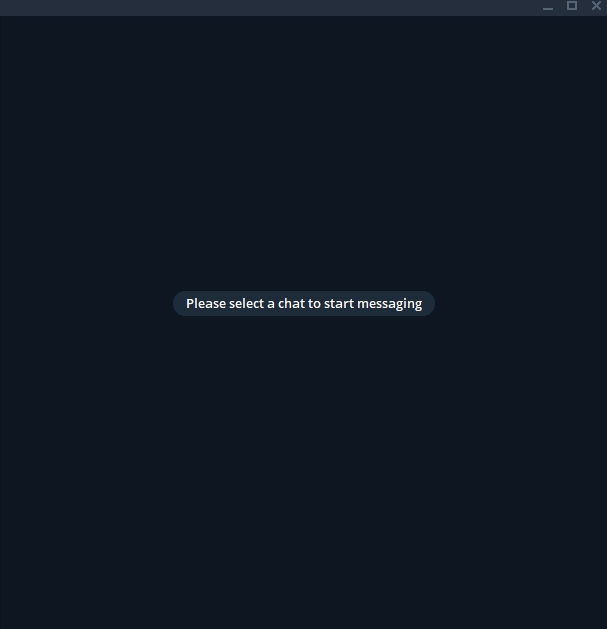

# telegram-chat-bot

A simple bot using telegram API to direct messages to and from [Cleverbot](https://www.cleverbot.com/) AI chatterbot.

## Requirements
The following items are required to be installed in the system:
Python 3, `pip`, FireFox and finally`geckodriver.exe` is downloaded and added as system path variable.

## Installation
To install the bot, use the following commands:
1. Activate virtual environment.
`\venv\Scripts\activate`
2. Install the required packages.
`pip install -r requirements.txt`

## Starting the bot
To run the bot
1. Activate virtual environment if it is not activated already.
`\venv\Scripts\activate`
2. Run the starter app (`main.py`)
`python main.py`
